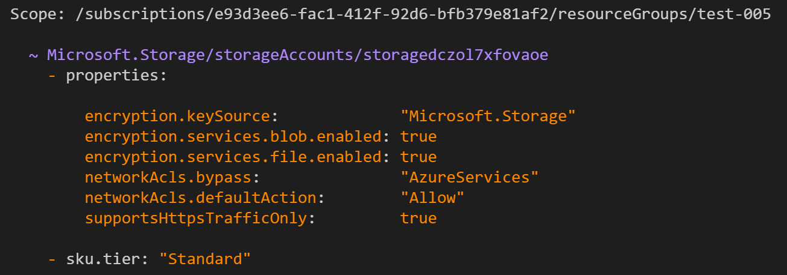

# Welcome to the ARM Template What-If issues repo

This repo is a little bit abnormal in that it is solely for keeping track of issues in the ARM Template what-if API. If you want to learn more about the what-if feature, you can take a look at this doc on the full capabilities of the what-if API and corresponding PowerShell cmdlet.

[Using the what-if feature of ARM Template deployments](https://google.com)

## What types of issues are you looking for?

The what-if issues fall into two buckets:
1. **Noise in the diff:** These are cases when what-if thinks a resource property will be changed (most often `deleted`) when in fact no change will occur. This is the *primary* motivation for this issue repo.
1. **Issues with formatting or general usability of the cmdlet or API:** There could be issues with formatting the diff, a parameter set may not be working correctly, etc.

## Why does noise occur?

Often times, a property may be returned in a GET request for a resource that is not specified in the ARM template. The What-If API has a noise reduction service to catch these false positives and not return them. However, there are many cases where these could be missed. When this happens, it's likely that the what-if API will tell you that a resource will be modified and a specific property is deleted.

Let's look at an example.

Below is a storage account object declaration in an ARM Template, which is a little different than a pure REST API PUT body:
```json
{
  "name": "storagedczol7xfovaoe",
  "type": "Microsoft.Storage/storageAccounts",
  "apiVersion": "2019-04-01",
  "sku": {
    "name": "Standard_LRS"
  },
  "kind": "Storage",
  "location": "eastus",
}
```

And here is only *part* of what the storage account looks like on GET. We've shortened in this readme, but you can see the full body [here](./storage-output.json):

```json
{
  "sku": {
    "name": "Standard_LRS",
    "tier": "Standard"
  },
  "kind": "Storage",
  "id": "/subscriptions/e93d3ee6-fac1-412f-92d6-bfb379e81af2/resourceGroups/test-005/providers/Microsoft.Storage/storageAccounts/storagedczol7xfovaoe",
  "name": "storagedczol7xfovaoe",
  "type": "Microsoft.Storage/storageAccounts",
  "location": "eastus",
  "tags": {},
  "properties": {
    "networkAcls": {
      "bypass": "AzureServices",
      "virtualNetworkRules": [],
      "ipRules": [],
      "defaultAction": "Allow"
    },
    "supportsHttpsTrafficOnly": true,
    ...
  }
}
```

In order to output a clean diff, we do post-processing on the diff to remove all of this noise, but there are many cases that have not yet been accounted for. If we run the same storage account creation through what-if, then we will see some of this noise:



## How do I submit an issue?

In order to take an action on noise you encounter, please open an issue and include the following information:
1. Resource type (i.e. `Microsoft.Storage/storageAccounts`)
1.  apiVersion (i.e. `2019-04-01`)
1.  Client (PowerShell, Azure CLI, API)
1. Relevant ARM Template code (we only need the resource object specified in `1` and `2`, but if it's easier you can include the entire template
1. Expected response (i.e. "I expected no noise since the template has not been modified since the resources were deployed)
1. Current (noisy) response (either include a screenshot of the what-if output, or copy/paste the text)

### Sample issue
You can see a sample issue for the above [here](https://github.com/Azure/arm-template-whatif/issues/1). Hopefully it gets closed soon :)

# Contributing

This project welcomes contributions and suggestions.  Most contributions require you to agree to a
Contributor License Agreement (CLA) declaring that you have the right to, and actually do, grant us
the rights to use your contribution. For details, visit https://cla.opensource.microsoft.com.

When you submit a pull request, a CLA bot will automatically determine whether you need to provide
a CLA and decorate the PR appropriately (e.g., status check, comment). Simply follow the instructions
provided by the bot. You will only need to do this once across all repos using our CLA.

This project has adopted the [Microsoft Open Source Code of Conduct](https://opensource.microsoft.com/codeofconduct/).
For more information see the [Code of Conduct FAQ](https://opensource.microsoft.com/codeofconduct/faq/) or
contact [opencode@microsoft.com](mailto:opencode@microsoft.com) with any additional questions or comments.
