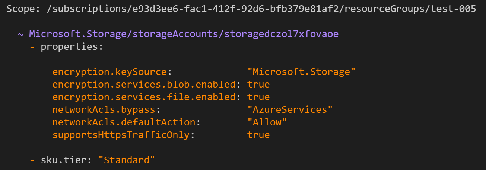

# Welcome to the ARM Template What-If issues repo

This repo is a little bit abnormal in that it is solely for keeping track of issues in the ARM Template what-if API. If you want to learn more about the what-if feature, you can take a look at this doc on the full capabilities of the what-if API and corresponding PowerShell cmdlet.

 * [ARM template deployment what-if operation](https://learn.microsoft.com/azure/azure-resource-manager/templates/deploy-what-if)
 * [What-if for Azure deployment stacks](https://learn.microsoft.com/azure/azure-resource-manager/bicep/deployment-stacks-what-if)
 * [What's new in ARM Templates - November 2019 #MSIgnite Session (YouTube)](https://www.youtube.com/watch?v=3D-JIKShrws&feature=youtu.be&t=771)

 For a guided tutorial on What-If, check out this [MS Learn module](https://learn.microsoft.com/training/modules/arm-template-test/).

## Recent Updates and Enhancements
* **What-if for Azure deployment stacks is generally available** (August 2026). Stacks what-if evaluates a change in the context of a deployment stack, adds the `Detach` and `Delete` change types for resources leaving stack management, and writes a durable `Microsoft.Resources/deploymentStacksWhatIfResults` resource you can retrieve later or use as a pipeline approval artifact. See the [announcement](https://techcommunity.microsoft.com/blog/azuregovernanceandmanagementblog/now-generally-available-what-if-for-azure-deployment-stacks/4547614) and the [documentation](https://learn.microsoft.com/azure/azure-resource-manager/bicep/deployment-stacks-what-if).
* **Noise reduction for stacks what-if is enabled in all regions.** Stacks what-if filters properties that are unchanged against a baseline recorded when the stack was deployed, which removes a large class of the false positives this repo was created to track. Two things worth knowing: the baseline only exists once a stack has been deployed or updated, so it does not apply to a first deployment, and it removes many common differences rather than every difference.
* We removed the need for the user/spn to have /write permission on the resources if the user specified the “no rbac” flag. Now we can add the flag ```-validationLevel "ProviderNoRbac"``` to achieve this.
* To prevent secrets from leaking, ```SecureString``` and ```SecureObject``` parameters have always been replaced with placeholders in the WhatIf output. WhatIf will now also replace values derived from ```SecureString``` and ```SecureObject``` parameters with placeholders.

## Recently Resolved

* **Deny policy validation** is being evaluated again. A template that violates a deny policy assignment now returns `RequestDisallowedByPolicy` through the what-if path rather than silently passing.
* **Nested deployment short-circuiting** was addressed and rolled out to all regions (tracked in [#157](https://github.com/Azure/arm-template-whatif/issues/157)). What-if now expands nested deployments whose parameters are derived from a `reference()` to another resource, so evaluation no longer stops at the module boundary.

## Ongoing Issues

Noise reduction addresses false positives, meaning properties reported as changed that did not change. It does not address the classes below, which is why they remain open:

* **Array element identity.** Elements of an array are matched positionally rather than by key, so reordering or inserting can render a real change as an unrelated pair of edits. Tracked in [#387](https://github.com/Azure/arm-template-whatif/issues/387).
* **Missed changes.** A change that is never reported at all. Filtering unchanged properties cannot surface something absent from the result.
* **Incorrect change types.** A resource reported as `Create` when it already exists, or a `Delete` the service does not perform.
* **Unevaluated expressions.** `reference()` is not evaluated during what-if, so values derived from it cannot be compared. Tracked in [#83](https://github.com/Azure/arm-template-whatif/issues/83).
* **Provider-returned property noise on standard deployments.** Stacks what-if filters this class, but standard deployment what-if still reports it. Tracked per resource family in [#90](https://github.com/Azure/arm-template-whatif/issues/90), [#176](https://github.com/Azure/arm-template-whatif/issues/176), [#279](https://github.com/Azure/arm-template-whatif/issues/279), [#284](https://github.com/Azure/arm-template-whatif/issues/284), [#297](https://github.com/Azure/arm-template-whatif/issues/297) and [#337](https://github.com/Azure/arm-template-whatif/issues/337).

## Install the tooling

What-if is generally available, so no preview or prerelease module is required.

PowerShell:
```
Install-Module Az.Resources
```

The stacks what-if cmdlets (`New-AzResourceGroupDeploymentStackWhatIfResult` and its subscription and management group equivalents) require `Az.Resources` 10.1.0 or later.

Azure CLI:
```
az upgrade
```

The `az stack-whatif` command group requires Azure CLI 2.89.0 or later. Standard deployment what-if (`az deployment group what-if`) is available in earlier versions.

## What types of issues are you looking for?

The what-if issues fall into two buckets:
1. **Noise in the diff:** These are cases when what-if thinks a resource property will be changed (most often `deleted`) when in fact no change will occur. This is the *primary* motivation for this issue repo.
1. **Issues with formatting or general usability of the cmdlet or API:** There could be issues with formatting the diff, a parameter set may not be working correctly, etc.

## Why does noise occur?

Often times, a property may be returned in a GET request for a resource that is not specified in the ARM template. The What-If API has a noise reduction service to catch these false positives and not return them. However, there are many cases where these could be missed. When this happens, it's likely that the what-if API will tell you that a resource will be modified and a specific property is deleted.

Let's look at an example.

Below is a storage account object declaration in an ARM Template, which is a little different than a pure REST API PUT body:
```json
{
  "name": "storagedczol7xfovaoe",
  "type": "Microsoft.Storage/storageAccounts",
  "apiVersion": "2019-04-01",
  "sku": {
    "name": "Standard_LRS"
  },
  "kind": "Storage",
  "location": "eastus",
}
```

And here is only *part* of what the storage account looks like on GET. We've shortened in this readme, but you can see the full body [here](./storage-output.json):

```json
{
  "sku": {
    "name": "Standard_LRS",
    "tier": "Standard"
  },
  "kind": "Storage",
  "id": "/subscriptions/e93d3ee6-fac1-412f-92d6-bfb379e81af2/resourceGroups/test-005/providers/Microsoft.Storage/storageAccounts/storagedczol7xfovaoe",
  "name": "storagedczol7xfovaoe",
  "type": "Microsoft.Storage/storageAccounts",
  "location": "eastus",
  "tags": {},
  "properties": {
    "networkAcls": {
      "bypass": "AzureServices",
      "virtualNetworkRules": [],
      "ipRules": [],
      "defaultAction": "Allow"
    },
    "supportsHttpsTrafficOnly": true,
    ...
  }
}
```

In order to output a clean diff, we do post-processing on the diff to remove all of this noise, but there are many cases that have not yet been accounted for. If we run the same storage account creation through what-if, then we will see some of this noise:



## How do I submit an issue?

In order to take an action on noise you encounter, please open an issue and include the following information:
1. Resource type (i.e. `Microsoft.Storage/storageAccounts`)
1.  apiVersion (i.e. `2019-04-01`)
1.  Client (PowerShell, Azure CLI, API)
1. Relevant ARM Template code (we only need the resource object specified in `1` and `2`, but if it's easier you can include the entire template
1. Expected response (i.e. "I expected no noise since the template has not been modified since the resources were deployed)
1. Current (noisy) response (either include a screenshot of the what-if output, or copy/paste the text)

### Sample issue
You can see a sample issue for the above [here](https://github.com/Azure/arm-template-whatif/issues/1). Hopefully it gets closed soon :)

# Contributing

This project welcomes contributions and suggestions.  Most contributions require you to agree to a
Contributor License Agreement (CLA) declaring that you have the right to, and actually do, grant us
the rights to use your contribution. For details, visit https://cla.opensource.microsoft.com.

When you submit a pull request, a CLA bot will automatically determine whether you need to provide
a CLA and decorate the PR appropriately (e.g., status check, comment). Simply follow the instructions
provided by the bot. You will only need to do this once across all repos using our CLA.

This project has adopted the [Microsoft Open Source Code of Conduct](https://opensource.microsoft.com/codeofconduct/).
For more information see the [Code of Conduct FAQ](https://opensource.microsoft.com/codeofconduct/faq/) or
contact [opencode@microsoft.com](mailto:opencode@microsoft.com) with any additional questions or comments.


